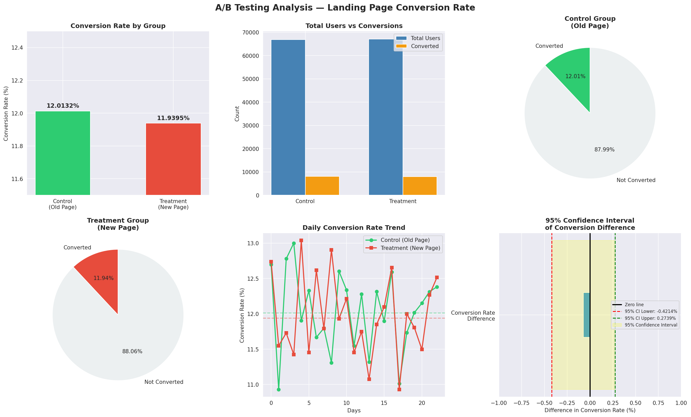

# 🧪 A/B Testing Analysis — Landing Page Conversion

## 📌 Project Overview
Statistical analysis of an e-commerce A/B test to determine
whether a new landing page design drives more conversions
than the existing page.

## 🛠️ Tools Used
- Python (pandas, numpy, matplotlib, seaborn, scipy, statsmodels)
- Statistical Tests: Chi-square, Z-test, Confidence Intervals
- Google Colab | GitHub

## 🔍 Key Results

| Metric | Value |
|---|---|
| Old Page Conversion Rate | 12.0563% |
| New Page Conversion Rate | 11.8945% |
| P-value | 0.6838 |
| 95% CI | (-0.4214%, 0.2739%) |
| Decision | **DO NOT launch new page** |

## 📊 Analysis Preview

## 🧪 Hypothesis Test
- **H0:** New page = Old page conversion rate
- **H1:** New page ≠ Old page conversion rate
- **Result:** Fail to reject H0 (p = 0.6838 > 0.05)

## 🚨 Data Quality Findings
- 1,333 mismatched rows removed (experiment design error)
- 19,165 duplicate users removed
- 4 typo rows removed
- Raw: 97,089 rows → Clean: 76,587 rows

## 💡 Business Recommendation
Do NOT roll out the new page. The conversion difference
of -0.16% is not statistically significant. Recommend
redesigning with user feedback and testing specific
page elements rather than full redesign.

## 👩‍💻 Author
Rekha Sida | github.com/rekhashida
